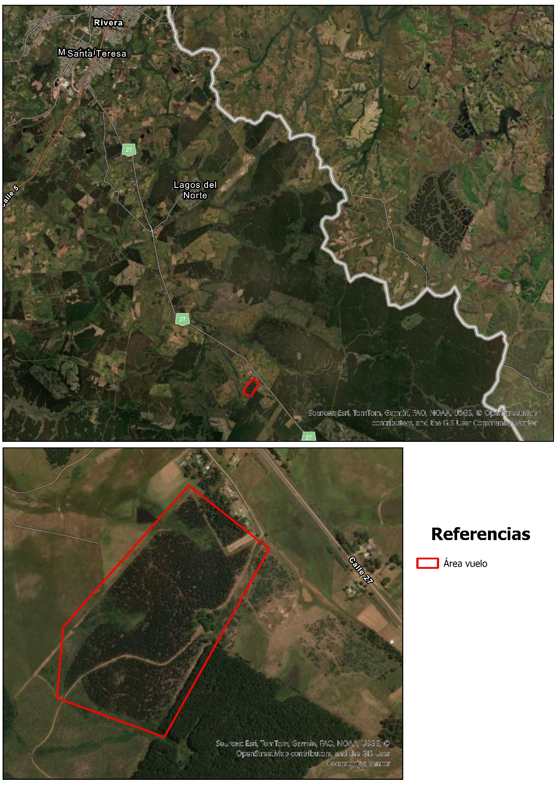
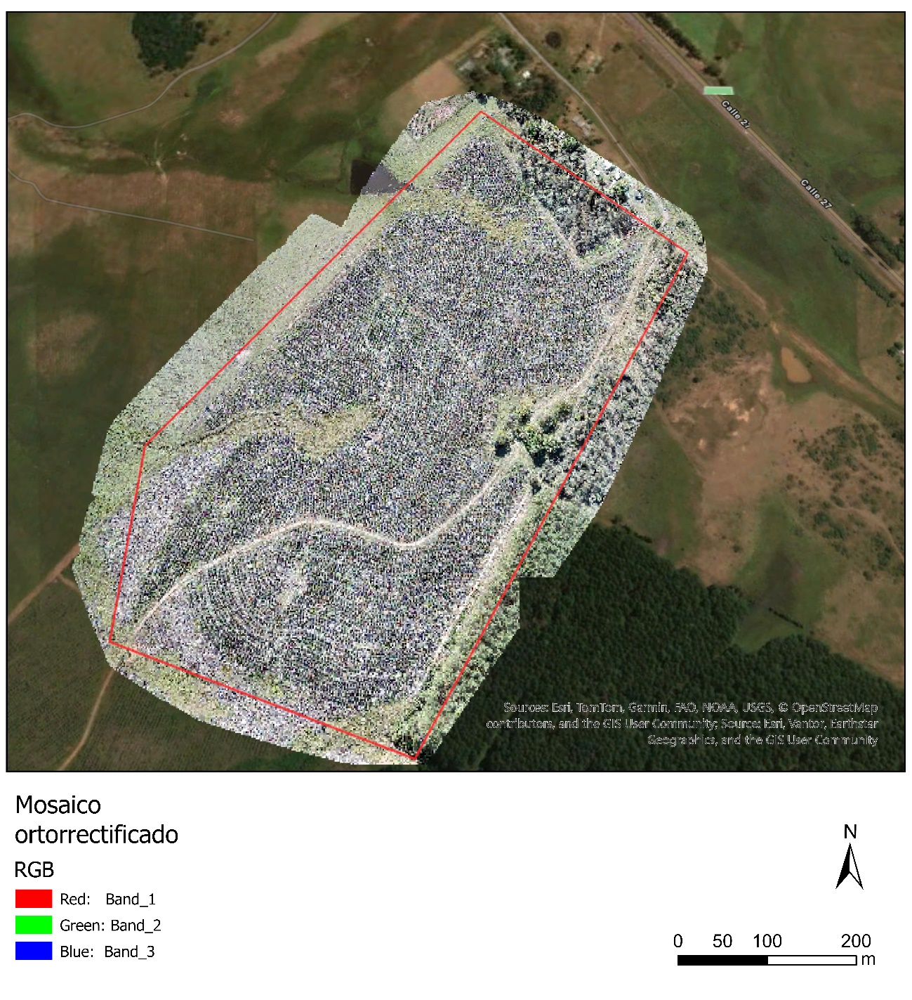
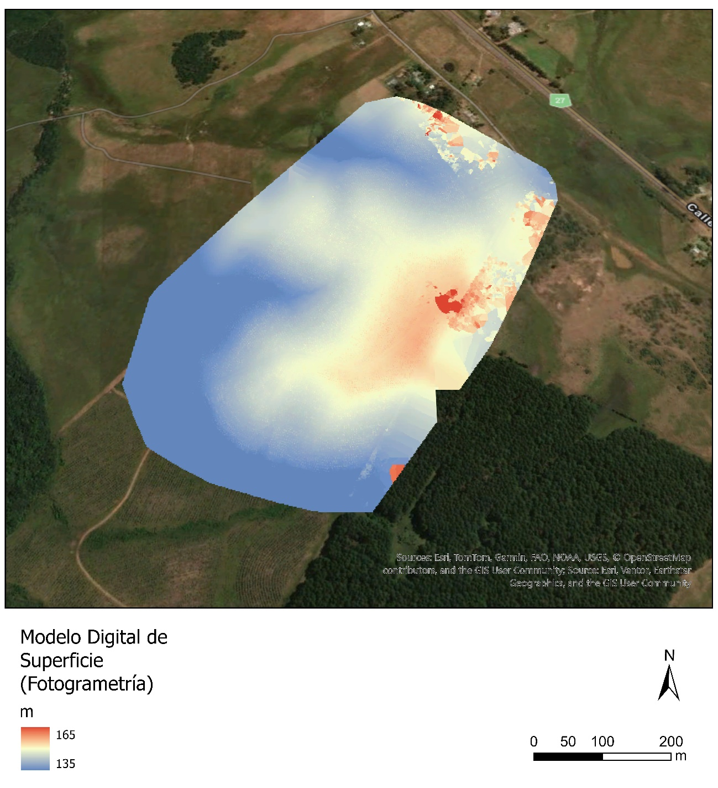
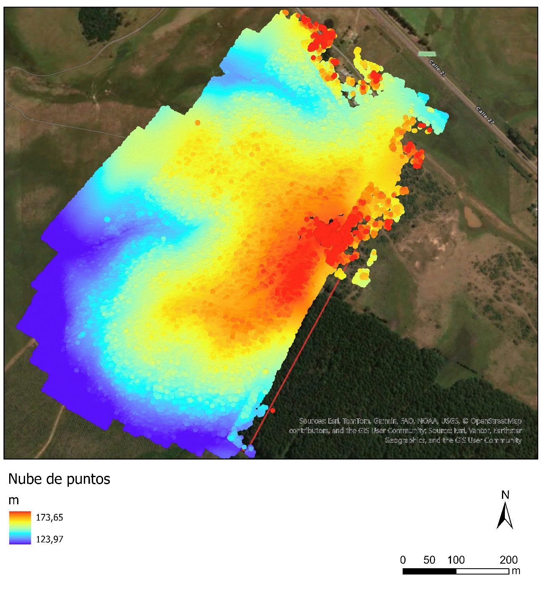

# Fotogrametría con dron: línea de base de una plantación forestal

## Objetivo

Establecer una línea de base del desarrollo de una plantación forestal recientemente implantada, que sirva de insumo para monitorear su crecimiento a lo largo del tiempo.

## Metodología

Con la finalidad de abordar el objetivo propuesto, se generaron los productos fotogramétricos: nube de puntos, modelo digital de superficie (MDS) y ortomosaico, sobre una plantación forestal recientemente implantada, de modo que puedan compararse con relevamientos posteriores para evaluar su desarrollo. El establecimiento se encuentra próximo (⁓22 Km) a la ciudad de Rivera (Uruguay) y el predio forestado alcanza las 22 ha (Fig. 1).

Se utilizaron 275 imágenes aéreas RGB obtenidas en mayo de 2023 mediante un vuelo (altura media 81 m, área cubierta 38 ha) realizado con el vehículo aéreo no tripulado DJI Phantom 4 Pro, equipado con una cámara FC6310, distancia focal de 8,8 mm, resolución de 4864 × 3648 píxeles, y su posterior procesamiento en el software Pix4Dmapper 4.6.4 (plantilla 3D Maps) mediante el flujo estándar de *structure from motion*. El sistema de coordenadas de salida fue WGS84 / UTM zona 21S (EGM96), con alturas ortométricas referidas al modelo de geoide EGM96. El ortomosaico y el MDS fueron generados a una resolución espacial de 2,5 cm/píxel.

   
  <em><b>Figura 1.</b> Área de estudio</em>

## Resultados

Los procedimientos fotogramétricos permitieron obtener los insumos fundamentales que servirán de base para evaluar el desarrollo vertical del cultivo forestal a lo largo del tiempo. Los resultados del ortomosaico (Fig. 2), del MDS (Fig. 3) y de la nube de puntos (Fig. 4) permiten observar la reciente implantación de los árboles. Estos productos fueron generados mediante imágenes ópticas (RGB), que reconstruyen únicamente la superficie visible desde el aire y no penetran el dosel, en una plantación forestal las alturas resultantes del MDS corresponden a la suma: altura de vegetación/copa + elevación del terreno (MDT). Sin embargo, las imágenes fueron obtenidas cuando la forestación se encontraba en su etapa inicial de desarrollo, por lo tanto, el MDS obtenido es muy similar al MDT y se puede considerar como la base sobre la cual comparar futuros MDS obtenidos a lo largo de los años para evaluar el progreso del crecimiento. El detalle de los parámetros de procesamiento y los resultados de calidad de los productos obtenidos queda disponible en: <https://github.com/BernardoZabaleta/TGEO/blob/main/Fotogrametria/Quality_report.pdf>

   
  <em><b>Figura 2.</b> Ortomosaico del área de estudio, generado por fotogrametría a partir de 275 imágenes aéreas RGB adquiridas con un vehículo aéreo no tripulado en mayo de 2023</em>

   
  <em><b>Figura 3.</b> Modelo digital de superficie del área de estudio, generado por fotogrametría a partir de 275 imágenes aéreas RGB adquiridas con un vehículo aéreo no tripulado en mayo de 2023</em>

   
  <em><b>Figura 4.</b> Nube de puntos densa del área de estudio, generada por fotogrametría a partir de 275 imágenes aéreas RGB adquiridas con vehículo aéreo no tripulado en mayo de 2023 (40,3 millones de puntos; densidad media de 107 puntos/m²)</em>

