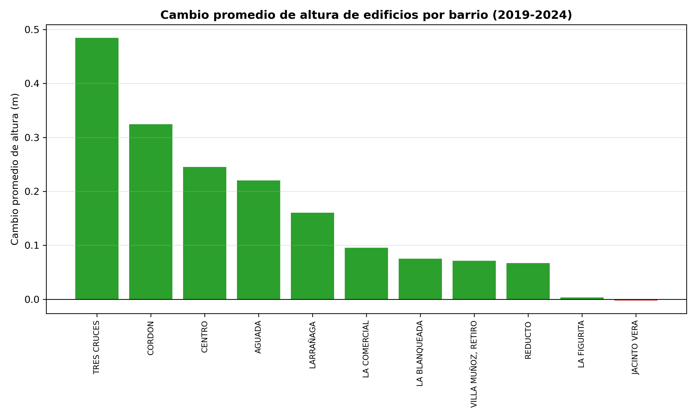

# LiDAR: evolución de la altura de las edificaciones en barrios de Montevideo (2019–2024)

## Objetivo

Evaluar la distribución espacial y la evolución temporal de la altura de las edificaciones en un conjunto de barrios cercanos al centro de Montevideo entre 2019 y 2024.

## Metodología

La estrategia metodológica consistió en la obtención, procesamiento y comparación de dos (2019 y 2024) modelos digitales de superficie (MDS) en un conjunto de barrios de Montevideo (Fig. 1). Para ello, se descargaron del sitio <https://visualizador.ide.uy/ideuy/core/load_public_project/ideuy/#> los MDS (.tif) del año 2019 correspondientes al área de estudio. Este producto es disponibilizado por la Infraestructura de Datos Espaciales de Uruguay, fue obtenido mediante el levantamiento aerofotogramétrico con la cámara UltraCam Eagle Prime, el tamaño del píxel en terreno (GSD) es de 10 cm y una altura de vuelo aproximada de 2100 m. Su sistema de coordenadas es SIRGAS-ROU98 / UTM zona 21S y el cálculo de las cotas ortométricas mediante el modelo geoidal EGM2008. Los archivos raster (.tif) descargados fueron remuestreados a una resolución espacial de 2,5 m; utilizando el valor máximo de los píxeles originales contenidos en cada nueva celda, e integrados en un único mosaico.

En cuanto al año 2024, se descargaron nubes de puntos LiDAR (.laz) del sitio <https://montevideo.gub.uy/app/mapas/#/viewer/26> coincidentes con los barrios de estudio. Este producto lo disponibiliza la Intendencia Departamental de Montevideo, fue obtenido mediante el sensor Trimble LiDAR, con una densidad de 16 puntos/m², una altura de vuelo de ⁓550 m, una precisión vertical de ⁓30 cm y diferencia diversas clases de cobertura del suelo. Una vez descargadas las nubes de puntos, se integraron en un LAS Dataset, se seleccionaron los puntos clasificados como edificaciones (clase 6) y se generó una grilla con una resolución espacial de 2,5 m; asignando a cada celda el valor máximo de altura de los puntos correspondientes a edificaciones. De esta manera, se obtuvo para 2024 un MDS (.tif) de altura máxima de las edificaciones, que se alineó espacialmente con el MDS de 2019 y se calculó la diferencia de altura entre ambos mediante la resta de los respectivos valores de cada celda. El raster (.tif) resultante permitió identificar espacialmente los cambios de altura en las edificaciones durante el período analizado. Los procesamientos y análisis de datos fueron realizados mediante código Python en Jupyter Notebook, disponible en <https://github.com/BernardoZabaleta/TGEO/blob/main/LiDAR/img/codigo_python.py>.

Con el objetivo de identificar patrones de distribución espacial en las diferencias de altura, el raster resultante fue convertido a formato vectorial (.shp) y se calculó el índice I de Moran global. Este estadístico permite evaluar la existencia de autocorrelación espacial, es decir, determinar si valores similares de la variable analizada tienden a concentrarse espacialmente. La hipótesis nula establece una distribución espacial aleatoria, mientras que la hipótesis alternativa plantea la existencia de autocorrelación espacial.

En caso de identificar autocorrelación espacial estadísticamente significativa, se aplicó el estadístico Getis-Ord Gi\* para identificar agrupamientos espaciales de valores altos y bajos. Los valores positivos del estadístico z asociados a significancia estadística indican agrupamientos de valores altos (*hot spots*), mientras que los valores negativos estadísticamente significativos indican agrupamientos de valores bajos (*cold spots*). Los análisis de estadística espacial fueron realizados en ArcGIS Pro 3.7.0.

   
  <em><b>Figura 1.</b> Conjunto de barrios de estudio en las proximidades al centro de Montevideo</em>

## Resultados

Los resultados obtenidos evidencian que la metodología empleada permite caracterizar y evaluar el desarrollo vertical de la ciudad a partir de la comparación temporal de modelos digitales de superficie (específico para edificaciones) y que el procedimiento puede ser replicado para ampliar el análisis a todo el Departamento de Montevideo.

Una de las principales limitaciones identificadas se relaciona con la naturaleza de los MDS utilizados. El MDS de 2019 fue generado mediante un levantamiento aerofotogramétrico y representa la superficie visible, por lo que no permite diferenciar directamente los edificios de otras clases. En cambio, a partir de los datos LiDAR de 2024 es posible generar un MDS específico para los edificios y utilizar su localización como referencia para realizar comparaciones retrospectivas. En este sentido, la metodología resulta adecuada para evaluar diferencias en la altura de las edificaciones dentro de áreas donde existe correspondencia espacial entre ambas fechas, pero presenta limitaciones para identificar cambios en la cobertura del suelo. Por ejemplo, no permite determinar directamente situaciones en las que un área que presentaba edificaciones en 2019 haya sido posteriormente transformada en otra clase de cobertura como podría ser vegetación.

El procedimiento desarrollado puede, asimismo, extenderse al análisis de otras clases de cobertura del suelo. Esto permitiría incorporar nuevas dimensiones al estudio de las transformaciones urbanas, incluyendo la relación entre el desarrollo vertical y su potencial aumento demográfico, con la evolución de los espacios verdes. Este tipo de análisis podría resultar de particular interés en el contexto del cambio climático, considerando el papel de la vegetación urbana en la regulación de las temperaturas extremas.

En los MDS correspondientes a 2019 (Fig. 2) y 2024 (Fig. 3) se observa que las mayores alturas se concentran principalmente en un eje que atraviesa los barrios Centro y Cordón (Av. 18 de Julio) y se extiende hacia Tres Cruces, Larrañaga y La Blanqueada. El análisis de autocorrelación espacial de Moran indica la existencia de un fuerte patrón de agrupamiento espacial (p-valor < 0,05; Z-Score = 626,55), lo que evidencia que la distribución espacial de los valores analizados no es aleatoria (<https://github.com/BernardoZabaleta/TGEO/blob/main/LiDAR/img/MoransI_result.JPG>).

   
  <em><b>Figura 2.</b> Modelo Digital de Superficie (MDS) correspondiente al año 2019, obtenido mediante levantamiento aerofotogramétrico y disponibilizado por la Infraestructura de Datos Espaciales de Uruguay (IDEUy)</em>

   
  <em><b>Figura 3.</b> Modelo Digital de Superficie (MDS) correspondiente al año 2024, elaborado a partir de los puntos clasificados como edificaciones en la nube de puntos LiDAR disponibilizada por la Intendencia de Montevideo</em>

El análisis de puntos calientes indica que los principales agrupamientos de edificios que presentaron incrementos de altura durante el período analizado se localizan principalmente en las proximidades al centro de Montevideo (Fig. 4 y Fig. 5). Este patrón es consistente con los cambios promedio en la altura de las edificaciones observados a escala barrial, donde el barrio Tres Cruces presentó el mayor incremento promedio, seguido por Cordón y Centro, mientras que Aguada y Larrañaga registraron incrementos de menor magnitud (Fig. 6).

   
  <em><b>Figura 4.</b> Diferencia en la altura de las edificaciones entre los años 2019 y 2024, obtenida mediante la comparación de los Modelos Digitales de Superficie (MDS) correspondientes a ambos años</em>

   
  <em><b>Figura 5.</b> Puntos calientes obtenidos mediante el estadístico Getis-Ord Gi*, que identifica agrupamientos espaciales estadísticamente significativos de incrementos en la altura de las edificaciones entre los años 2019 y 2024</em>

   
  <em><b>Figura 6.</b> Variación promedio en la altura de las edificaciones por barrio entre los años 2019 y 2024</em>

En conjunto, estos resultados evidencian que los sectores de Centro y Cordón, además de concentrar algunas de las mayores alturas, continúan registrando procesos de crecimiento vertical. A su vez, el mayor incremento promedio observado en Tres Cruces resulta particularmente relevante, ya que este barrio se encuentra inmediatamente próximo al eje Centro–Cordón y constituye una continuidad espacial del sector con mayor desarrollo vertical identificado en el análisis.
