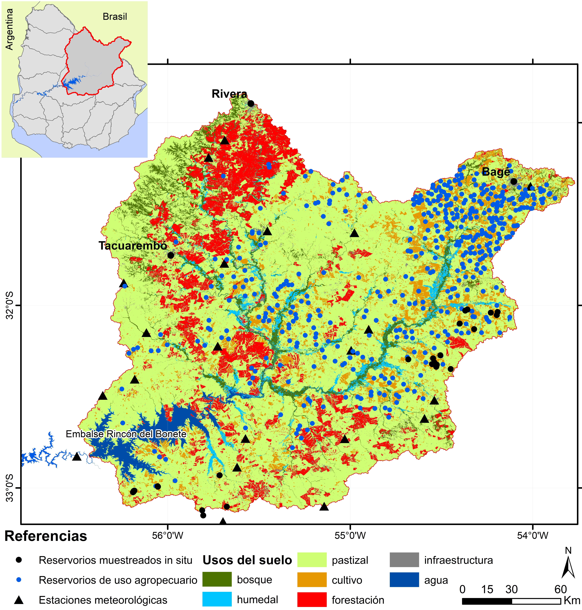
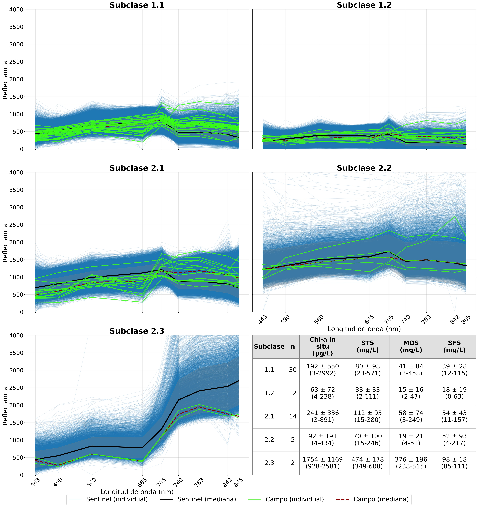
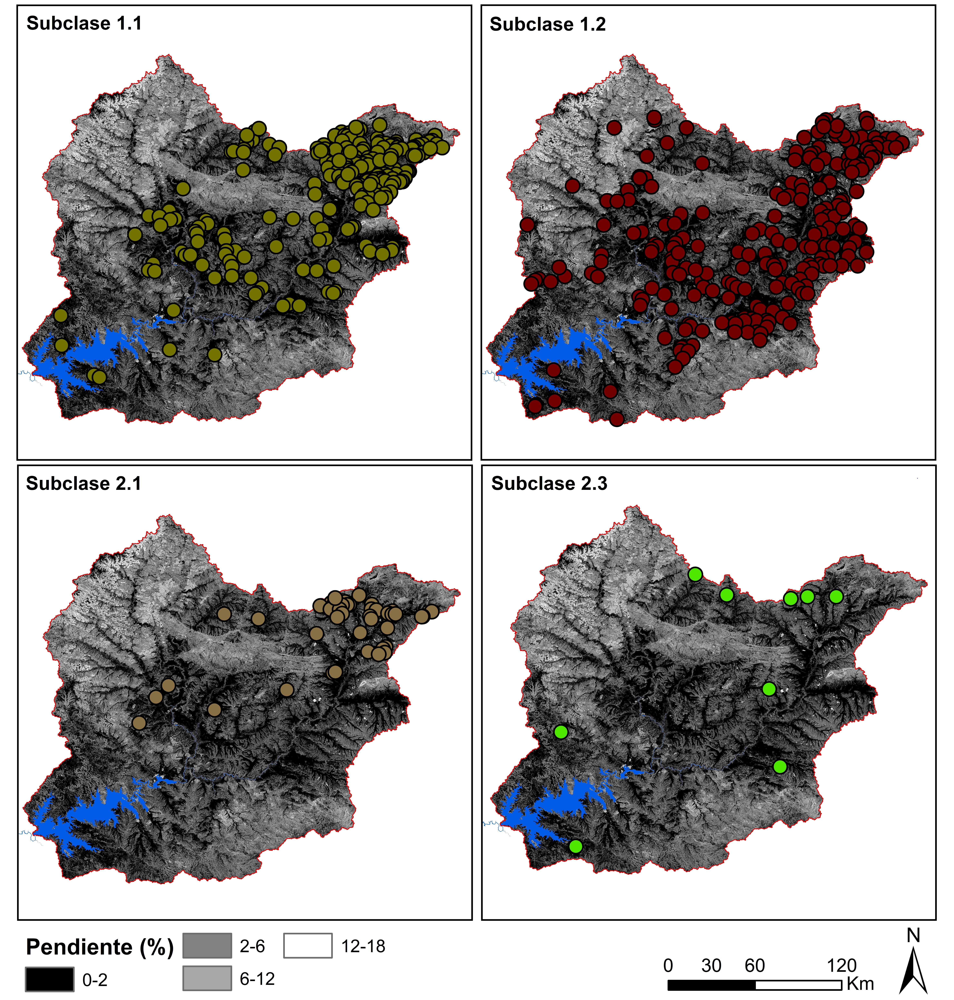

# Clasificación espectral de reservorios de uso productivo — cuenca del Río Negro (Sentinel-2)

Análisis exploratorio del comportamiento óptico de 485 reservorios de agua de uso productivo ubicados en la cuenca que drena hasta el embalse Rincón del Bonete, a partir de series temporales de reflectancia superficial Sentinel-2 (2019–2026), y su relación con variables meteorológicas, estructurales y de usos del suelo.

**Herramientas:** Google Earth Engine · Python (Jupyter Notebook, scikit-learn) · ArcGIS Pro 3.7.0

---

## Objetivo

Clasificar las respuestas espectrales de los reservorios de agua de uso productivo ubicados en la cuenca del Río Negro que drena hasta el embalse Rincón del Bonete y explorar su relación con condiciones meteorológicas, variables estructurales y con los usos del suelo.

---

## Metodología

La estrategia metodológica consta de cuatro etapas:

1. **Extracción de reflectancia superficial (Rrs)** de 485 reservorios de agua a partir del producto L2A del satélite Sentinel-2 en el período 2019–2026.
2. **Análisis de agrupamiento** de los datos para explorar el comportamiento espectral de los reservorios.
3. **Delimitación de las áreas de drenaje (microcuencas)** de cada reservorio y obtención, para cada una, de variables meteorológicas (precipitación, temperatura), estructurales (pendientes, tamaño, textura del suelo) y de usos del suelo.
4. **Exploración de las relaciones** entre dichas variables y el comportamiento óptico de los reservorios mediante análisis de aprendizaje automático.

### Área de estudio

El área de estudio comprende la cuenca que drena hasta el embalse hidroeléctrico Rincón del Bonete y los 485 reservorios de agua con fines productivos (> 5 ha). En total abarca una superficie de 39.700 km², donde 3.190 km² se encuentran en territorio brasilero. Rincón del Bonete es el embalse más grande del país: se extiende por 1.070 km², presenta un volumen total aproximado de 8.800 hm³ y alcanza una profundidad máxima de 32 m. La cuenca de estudio se caracteriza por la diversidad de usos del suelo, con predominancia de suelos cubiertos por pastizales (66%), seguidos por los monocultivos forestales (12%) y la agricultura (10%) (Fig. 1).

  

  <i>Figura 1. Área de estudio. Cuenca del Río Negro que drena hasta el embalse hidroeléctrico Rincón del Bonete y sus usos del suelo de acuerdo con la clasificación realizada por MapBiomas para el año 2024.</i>

### Obtención de firmas espectrales

Con la finalidad de explorar el comportamiento espectral de los 485 reservorios ubicados en la cuenca de estudio, se obtuvo la Rrs en el período 2019–2026 a partir del procesamiento en Google Earth Engine (GEE) del producto Sentinel-2/L2A. El nivel L2A corresponde a la reflectancia superficial obtenida mediante el algoritmo de corrección atmosférica Sen2Cor, utilizado con éxito para monitorear cuerpos de agua continentales (Ansper y Alikas, 2019).

Para evitar extraer Rrs en píxeles de la interfaz tierra-agua, se delimitó la superficie mínima cubierta por agua de los reservorios y se generaron polígonos que luego fueron utilizados para extraer el promedio de la Rrs. Para ello se delimitó la superficie máxima de agua de los reservorios mediante el índice de diferencia normalizada del agua (NDWI) estimado para toda la cuenca (2019–2026), se seleccionó la fecha con mayor extensión y se delimitaron los reservorios en su mayor extensión. Esos polígonos fueron utilizados para asignar un ID a cada reservorio y estimar la variación de la superficie cubierta por agua (`water_ha`) en el período de estudio mediante imágenes Sentinel-1 (banda C, modo GRD, polarización VV), obtenidas de la colección `COPERNICUS/S1_GRD` disponible en GEE (Gorelick et al., 2017).

Sobre cada imagen se aplicó un umbral fijo de retrodispersión (σ⁰ < −16 dB) para generar una máscara binaria agua/no agua, criterio ampliamente utilizado dado el fuerte contraste de reflectividad especular entre superficies de agua en calma y superficies terrestres en imágenes SAR (Torres et al., 2012). Durante los meses de menor extensión se descargó una imagen Sentinel-2 que fue utilizada para ajustar los polígonos según la mínima extensión de cada reservorio. Estos polígonos (`.shp`) se utilizaron para extraer el promedio de la Rrs de los píxeles (20 × 20 m) ubicados dentro de cada reservorio, aplicando el enmascaramiento de sombras y nubes según [s2cloudless](https://developers.google.com/earth-engine/tutorials/community/sentinel-2-s2cloudless). Todos los procedimientos fueron realizados combinando código de Python en Jupyter Notebook y ArcGIS Pro 3.7.0.

### Muestreos in situ

Se realizaron tres muestreos in situ los días 13/08/2025, 15/11/2025 y 10/02/2026, complementados con datos obtenidos para reservorios de uso agropecuario en la cuenca del Río Santa Lucía (n = 48). Los muestreos se realizaron en simultáneo con el pasaje de Sentinel-2 (± 3 h) y se extrajo el promedio de Rrs para todas las bandas del producto Sentinel-2/L2A considerando cuadrículas de 3 × 3 píxeles, ya que los datos pueden no ser precisos para un solo píxel (Clark et al., 2017).

En cada embalse se tomaron 3 réplicas de 1 L para análisis de clorofila-a (Chl-a), sólidos totales (STS), orgánicos (MOS) e inorgánicos en suspensión (SFS). Se filtraron las muestras de agua (por réplica) con dos filtros (MGF, Munktell): uno previamente quemado a 450 °C y pesado para el análisis de sólidos en suspensión, y otro para la extracción de Chl-a. Se determinó la concentración de sólidos en suspensión y materia orgánica en suspensión por el método gravimétrico/calcinación, respectivamente (APHA, 2005). La concentración de Chl-a se determinó por el método de extracción con etanol caliente (Nusch, 1980).

### Análisis de datos

Para clasificar el comportamiento espectral de los reservorios se utilizaron las firmas espectrales en análisis de agrupamiento. Dado que la Rrs puede ser covariante entre bandas cercanas, previo al agrupamiento se estandarizaron las bandas y se realizó un análisis PCA; se identificaron los componentes que alcanzan la mayor varianza y luego se detectó la división óptima de la totalidad de firmas espectrales mediante el análisis del "codo". Se realizó el análisis k-medias con la división óptima, y este procedimiento se repitió para cada conjunto identificado, de modo que se obtuvieron subclases. Para comprender si existe una coherencia interna entre las subclases consistente con los datos in situ de Chl-a y sólidos en suspensión, se clasificaron las firmas espectrales obtenidas en simultáneo con los muestreos mediante los modelos k-means entrenados y la replicación del esquema jerárquico de dos niveles. Los procedimientos de estandarización, PCA y k-medias se implementaron mediante la librería scikit-learn (Pedregosa et al., 2011) en Python.

Se exploraron las relaciones entre los conjuntos de firmas espectrales (subclases) y las precipitaciones, temperatura del aire y `water_ha` (variables predictivas dinámicas), y pendientes, textura del suelo y usos del suelo (variables predictivas fijas), mediante árboles de clasificación CART (Breiman et al., 1984). Se escogió este análisis por su flexibilidad: no asume ninguna distribución de probabilidad, permite detectar relaciones no lineales entre variables, explorar grandes conjuntos de datos en busca de patrones, gestionar numerosos predictores y detectar los más apropiados para predecir los datos utilizados (James et al., 2013). Este análisis es ampliamente utilizado para reportar mecanismos de influencia de variables ambientales en la calidad del agua (Zhang et al., 2021; Liu et al., 2017).

Para obtener las variables predictivas del análisis CART se delimitaron las microcuencas de los reservorios a partir del procesamiento del modelo digital de elevaciones ALOS PALSAR (resolución 12,5 m), descargado del [servidor ASF](https://search.asf.alaska.edu/#/). Se utilizaron las microcuencas para extraer el promedio y la máxima pendiente, la predominancia en la textura de los suelos de acuerdo con las cartas de suelos CONEAT y del Instituto Brasileiro de Geografia e Estatística en la zona de la cuenca ubicada en Brasil, y las superficies de usos del suelo para los años del período de estudio en que MapBiomas (Gallego et al., 2026) cuenta con información (2019, 2020, 2021, 2022, 2023 y 2024). Se evaluó la asociación entre el porcentaje de las subclases en cada reservorio y las variables fijas correspondientes a las características de cada microcuenca (usos del suelo, pendientes y textura de suelo) mediante el coeficiente de correlación de rangos de Spearman.

Por otro lado, se obtuvieron los datos de precipitaciones acumuladas diarias y temperatura promedio diaria en las estaciones meteorológicas ubicadas en la cuenca, mediante una solicitud de información al Instituto Uruguayo de Meteorología. Para cada reservorio se obtuvo, de la estación meteorológica más cercana, el promedio de temperatura y de precipitaciones acumuladas en los días previos a la obtención de cada firma espectral, de acuerdo con seis cortes temporales (3, 7, 15, 30, 60 y 90 días previos). Se obtuvo una aproximación al volumen de agua capturado por cada microcuenca mediante la multiplicación entre las áreas de drenaje y las precipitaciones. Los árboles de clasificación se ajustaron de forma independiente para el primer nivel de agrupamiento y para las subclases, utilizando el algoritmo `DecisionTreeClassifier` de scikit-learn (Pedregosa et al., 2011) y reservando el 30% de las firmas como conjunto de prueba de forma estratificada por clase, a partir del cual se obtuvo la matriz de confusión para estimar el porcentaje de error.

---

## Resultados

En total se obtuvieron **235.239 firmas espectrales** a lo largo del período 2019–2026. El 99% de la varianza es explicada por tres componentes principales de acuerdo con el análisis PCA realizado. Se utilizaron esos tres componentes para obtener la cantidad óptima de agrupamientos en que se dividen las firmas espectrales, la cual resultó en dos grandes conjuntos. Con los datos de cada conjunto se volvió a realizar la evaluación de la división óptima y se obtuvo que el clúster 1 se divide en dos subclases (1.1 y 1.2; n = 90.095 y 86.751, respectivamente), mientras que el clúster 2 se divide en tres subclases (2.1, 2.2 y 2.3; n = 42.758, 10.005 y 5.627, respectivamente).

Las firmas espectrales obtenidas en simultáneo con los muestreos in situ fueron asignadas a las subclases detectadas; la subclase a la que se asignaron más firmas fue la 1.1, seguida por 2.1, 1.2, 2.2 y 2.3 (30, 14, 12, 5 y 2, respectivamente). Las subclases 1.1 y 1.2 corresponden a las aguas con la menor reflectancia en todas las bandas, principalmente en las infrarrojas (> 705 nm), comportamiento característico de ambientes con elevada concentración de CDOM (Neil et al., 2019; Spyrakos et al., 2018). Si bien en este estudio no se midió CDOM in situ, la subclase 1.2 presentó la menor concentración de Chl-a y de sólidos en suspensión, mientras que la subclase 1.1 se diferencia por una mayor concentración de ambos, en especial de Chl-a; en este sentido, 1.1 podría relacionarse con aguas eutróficas y 1.2 con aguas oscuras.

En cuanto a la subclase 2.1, se reportó elevada concentración de sólidos en suspensión y Chl-a, lo que se evidencia en las firmas espectrales en la baja reflectancia de la banda de 665 nm, característica de la Chl-a, que determina un valle entre 560 nm y 705 nm. La subclase 2.2 presentó la mayor variabilidad y los datos in situ destacan que es la subclase con mayor concentración de sólidos inorgánicos en suspensión, lo que podría evidenciarse en la elevada reflectancia en todas las bandas, principalmente en los infrarrojos; sin embargo, es la subclase con mayor "ruido" y no es posible asignarla a un tipo óptico de agua. Por último, la subclase 2.3 tiene la forma y magnitud características de ambientes hipereutróficos con concentraciones máximas de Chl-a, lo que se evidenció en los datos in situ, por lo que podría asignarse a aguas verdes hipereutróficas (Fig. 2).

  

  <i>Figura 2. Firmas espectrales agrupadas por subclase de acuerdo con el análisis de agrupamiento jerárquico realizado (gráficas) y la pertenencia a cada subclase de las firmas espectrales correspondientes a los muestreos de campo (línea verde). En la tabla se presenta el promedio ± desvío estándar y el rango mínimo-máximo de la clorofila-a (Chl-a), sólidos totales (STS), orgánicos (MOS) e inorgánicos en suspensión (SFS) de acuerdo con los muestreos in situ.</i>

Se obtuvo la frecuencia de las subclases en cada reservorio: en total, 378 y 70 reservorios presentaron la misma subclase en más del 50% y 75% de los casos, respectivamente. La subclase con mayor dominancia fue 1.2, seguida por 1.1, 2.1 y 2.3 (225, 207, 43 y 9 reservorios, respectivamente) (Fig. 3). Como era esperable de acuerdo con la cantidad de firmas espectrales que conforman las subclases, estos resultados evidencian que si bien todas las subclases pueden comprender firmas espectrales de aguas eutróficas con concentración elevada de Chl-a, dicho pigmento domina la respuesta espectral únicamente en la subclase 2.3, que es la menos frecuente. Por lo tanto, la mayoría de los reservorios presentan aguas oscuras (1.2), seguidas por aguas turbias con posible desarrollo fitoplanctónico (1.1 y 2.1) y, en último lugar, los ambientes hipereutróficos con concentraciones máximas de Chl-a.

  

  <i>Figura 3. Subclases dominantes, de acuerdo con la frecuencia de las subclases obtenidas mediante análisis de agrupamiento de las firmas espectrales. De fondo: pendientes obtenidas del procesamiento del modelo digital de terreno ALOS PALSAR.</i>

El porcentaje de ocurrencia de cada subclase fue utilizado para relacionarlas con los usos del suelo y las características estructurales de las microcuencas. Las asociaciones más fuertes y significativas (p < 0,05) se detectaron entre la superficie de humedales y las subclases 1.2, 2.1 y 1.1, con una magnitud de correlación de Spearman (Rs) de 0,35, −0,33 y −0,24, respectivamente. Por otra parte, el aumento en la superficie de forestación es acompañado por el aumento en la frecuencia de 1.2 (Rs = 0,29), mientras que se reduce la ocurrencia de 2.1 (Rs = −0,31) y de 1.1 (Rs = −0,20). El cambio de signo en la correlación entre 1.2 y 2.1/1.1 podría evidenciar que los humedales promueven las aguas oscuras caracterizadas por alto contenido de CDOM y bajo desarrollo de fitoplancton, debido a que favorecen la retención de sólidos en suspensión y con ello de nutrientes provenientes del escurrimiento superficial de la cuenca (Johnston, 1991).

Las pendientes promedio y máxima se relacionaron de la misma forma, pero con menor intensidad, lo que podría deberse a que en las zonas de la cuenca con mayor pendiente los reservorios sean de mayor profundidad, favoreciendo la sedimentación de los sólidos en suspensión y reduciendo la resuspensión por efecto del viento (Eleveld, 2012; Chung et al., 2009). En cuanto a la textura del suelo, en 244 reservorios predominan los suelos de textura media, seguidos por los de textura pesada y liviana (187 y 57, respectivamente). En la textura liviana predomina la subclase 1.2 (88%), mientras que en la textura media y pesada se reparten más equitativamente entre las subclases 1.1 y 1.2 (50–38% y 44–46%, respectivamente).

El árbol de clasificación elaborado para el primer nivel de agrupamiento tuvo un error del 40% en la validación cruzada; si bien es un error elevado, permitió identificar las variables con mayor capacidad predictiva. El predictor de mayor importancia fue `water_ha`: cuando es ≤ 5,60 ha permite asignar las firmas espectrales al grupo 2. Por encima de ese umbral, la separación pasa a depender del promedio de temperatura del aire en los treinta días previos a cada dato satelital (T30) y, en menor medida, de las superficies cubiertas por forestación y humedal y de la textura de suelo. Estos resultados sugieren que las bajas superficies de agua promueven una condición de mayor turbidez.

El árbol elaborado para las subclases 1.1 y 1.2 también tuvo un error elevado (39%), donde el predictor de mayor importancia fue la textura liviana, que permite clasificar un 13% de los datos en la subclase 1.2, seguido por la superficie de humedales, que permite clasificar el 39% de las firmas espectrales en la subclase 1.2; las variables que le siguen en orden de importancia predictiva son la superficie urbana, T30 y la pendiente máxima. En cambio, el árbol elaborado para las subclases 2.1 y 2.3 fue el que presentó el mejor desempeño, con un error del 20% en la validación cruzada, y donde nuevamente `water_ha` fue la variable de mayor capacidad predictiva: las superficies de agua por debajo de 9 ha permiten clasificar el 14% de las firmas espectrales y promueven la subclase 2.3; las siguientes variables de mayor importancia predictiva fueron las superficies cubiertas por humedales y pastizales y la pendiente máxima.

Estos resultados sugieren que el estado trófico es resultado de una compleja interacción entre variables estructurales de la cuenca, de usos del suelo y meteorológicas, que presentan una influencia diferencial entre los reservorios (Weber et al., 2020). Este estudio representa una primera aproximación al comportamiento espectral de los reservorios de uso productivo ubicados en la cuenca de estudio, y pone de manifiesto la necesidad de ajustar modelos capaces de monitorear específicamente pigmentos como la Chl-a, de forma tal que se pueda seguir su comportamiento independientemente de los demás constituyentes ópticamente activos que, si bien determinan la respuesta espectral, no tienen tanto interés para la gestión como indicadores de desarrollo fitoplanctónico.

---

## Conclusiones

Se identificaron de manera exploratoria conjuntos de firmas espectrales con comportamientos ópticos coherentes con los datos de Chl-a y sólidos en suspensión obtenidos in situ. Los resultados aportan un primer criterio para focalizar los esfuerzos de muestreo y de gestión hacia los reservorios y subclases con mayor probabilidad de desarrollo fitoplanctónico. Sin embargo, las clasificaciones no son concluyentes para separar el efecto específico de la Chl-a del de los demás constituyentes ópticamente activos (CDOM y sólidos en suspensión), como se evidenció en la elevada variabilidad interna de la subclase 2.2 y en el error relativamente alto obtenido en los árboles de clasificación. Frente a esta limitación, los modelos lineales o semiempíricos ajustados específicamente para estimar la concentración de Chl-a a partir de bandas o índices espectrales sensibles a este pigmento podrían complementar la clasificación de las firmas espectrales, permitiendo un monitoreo cuantitativo y comparable en el tiempo en lugar de únicamente cualitativo. En este sentido, se destaca la necesidad de contar con modelos ajustados y validados localmente para monitorear la Chl-a de los reservorios de la cuenca del Río Negro de forma independiente de los demás constituyentes que determinan la respuesta espectral.

Los resultados de los árboles de clasificación y de las correlaciones de Spearman sugieren que la condición óptica de los reservorios responde a una interacción compleja entre el tamaño de los reservorios (`water_ha`), la temperatura, los usos del suelo y las pendientes de las microcuencas, variables que en conjunto modulan el tiempo de residencia del agua, el aporte de nutrientes, la concentración de CDOM y la resuspensión de sólidos. Este trabajo constituye una primera aproximación al comportamiento espectral de los reservorios de uso agropecuario de la cuenca del Río Negro y sienta las bases para el desarrollo de modelos específicos de Chl-a y para el diseño de estrategias de monitoreo in situ y de gestión productiva orientadas a reducir el riesgo de floraciones de cianobacterias y su eventual transporte aguas abajo.

---

## Bibliografía

- Ansper, A., Alikas, K. Retrieval of chlorophyll a from Sentinel-2 MSI data for the European Union water framework directive reporting purposes. *Remote Sensing*, v. 11, n. 1, p. 64, 2019. https://doi.org/10.3390/rs11010064
- APHA. *Standard methods for the examination of water and wastewater*. Washington: APHA/AWWA/WPCF, 2005.
- Breiman, L., Friedman, J., Olshen, R., Stone, C. *Classification and regression trees*. Boca Raton: CRC Press, 1984.
- Burford, M., Carey, C., Hamilton, D., Huisman, J., Paerl, H., Wood, S., Wulff, A. Perspective: advancing the research agenda for improving understanding of cyanobacteria in a future of global change. *Harmful Algae*, v. 91, p. 101601, 2020.
- Burford, M., O'Donohue, M. A comparison of phytoplankton community assemblages in artificially and naturally mixed subtropical water reservoirs. *Freshwater Biology*, v. 51, n. 5, p. 973-982, 2006. https://doi.org/10.1111/j.1365-2427.2006.01536.x
- Chung, E. G., Bombardelli, F. A., Schladow, S. G. Sediment resuspension in a shallow lake. *Water Resources Research*, v. 45, p. W05422, 2009. https://doi.org/10.1029/2007WR006585
- Clark, J., Schaeffer, B., Darling, J., Urquhart, E., Johnston, J., Ignatius, A., Myer, M., Loftin, K., Werdell, J., Stumpf, R. Satellite monitoring of cyanobacterial harmful algal bloom frequency in recreational waters and drinking water sources. *Ecological Indicators*, v. 80, p. 84-95, 2017.
- Eleveld, M. A. Wind-induced resuspension in a shallow lake from Medium Resolution Imaging Spectrometer (MERIS) full-resolution reflectances. *Water Resources Research*, v. 48, n. 4, p. W04508, 2012. https://doi.org/10.1029/2011WR011121
- Gallego, F., Barbieri, A., Ramos, S., Bruzzone, L., Vallejos, M., Rama, G., Baldassini, P., Baeza, S. La iniciativa MapBiomas Uruguay para monitorear los cambios anuales en el uso y cobertura del suelo entre 1985 y 2023. *Ecología Austral*, v. 36, n. 1, p. 31-46, 2026. https://doi.org/10.25260/EA.26.36.1.0.2568
- Gorelick, N., Hancher, M., Dixon, M., Ilyushchenko, S., Thau, D., Moore, R. Google Earth Engine: planetary-scale geospatial analysis for everyone. *Remote Sensing of Environment*, v. 202, p. 18-27, 2017.
- Haakonsson, S., Montesino, Y., Renom, M., Aubriot, L. Extreme temperatures increase the frequency of cyanobacterial blooms in subtropical reservoirs. *Science of The Total Environment*, v. 1009, p. 181086, 2025. https://doi.org/10.1016/j.scitotenv.2025.181086
- Hu, M., Ma, R., Cao, Z., Xiong, J., Xue, K. Remote estimation of trophic state index for inland waters using Landsat-8 OLI imagery. *Remote Sensing*, v. 13, n. 10, p. 1988, 2021. https://doi.org/10.3390/rs13101988
- Huisman, J., Codd, G., Paerl, H., Ibelings, B., Verspagen, J., Visser, P. Cyanobacterial blooms. *Nature Reviews Microbiology*, v. 16, n. 8, p. 471-483, 2018. https://doi.org/10.1038/s41579-018-0040-1
- James, G., Witten, D., Hastie, T., Tibshirani, R. *An introduction to statistical learning*. New York: Springer, 2013. (Springer Texts in Statistics, v. 112).
- Johnston, C. A. Sediment and nutrient retention by freshwater wetlands: effects on surface water quality. *Critical Reviews in Environmental Control*, v. 21, n. 5-6, p. 491-565, 1991.
- Liu, H., Li, Q., Shi, T., Hu, S., Wu, G., Zhou, Q. Application of Sentinel-2 MSI images to retrieve suspended particulate matter concentrations in Poyang Lake. *Remote Sensing*, v. 9, n. 7, p. 761, 2017. https://doi.org/10.3390/rs9070761
- Neil, C., Spyrakos, E., Hunter, P., Tyler, A. A global approach for chlorophyll-a retrieval across optically complex inland waters based on optical water types. *Remote Sensing of Environment*, v. 229, p. 159-178, 2019. https://doi.org/10.1016/j.rse.2019.04.027
- Nusch, E. A. Comparison of different methods for chlorophyll and phaeopigment determination. *Archiv für Hydrobiologie - Beiheft Ergebnisse der Limnologie*, v. 14, p. 14-36, 1980.
- Pedregosa, F., Varoquaux, G., Gramfort, A., Michel, V., Thirion, B., Grisel, O., Blondel, M., Prettenhofer, P., Weiss, R., Dubourg, V., Vanderplas, J., Passos, A., Cournapeau, D., Brucher, M., Perrot, M., Duchesnay, É. Scikit-learn: machine learning in Python. *Journal of Machine Learning Research*, v. 12, p. 2825-2830, 2011.
- Spyrakos, E., O'Donnell, R., Hunter, P. D., Miller, C., Scott, M., Simis, S. G. et al. Optical types of inland and coastal waters. *Limnology and Oceanography*, v. 63, n. 2, p. 846-870, 2018.
- Torres, R., Snoeij, P., Geudtner, D., Bibby, D., Davidson, M., Attema, E. et al. GMES Sentinel-1 mission. *Remote Sensing of Environment*, v. 120, p. 9-24, 2012.
- Weber, S., Mishra, D., Wilde, S., Kramer, E. Risks for cyanobacterial harmful algal blooms due to land management and climate interactions. *Science of the Total Environment*, v. 703, p. 134608, 2020. https://doi.org/10.1016/j.scitotenv.2019.134608
- Zhang, Y., Zhang, Y., Shi, K., Zhou, Y., Li, N. Remote sensing estimation of water clarity for various lakes in China. *Water Research*, v. 192, p. 116844, 2021. https://doi.org/10.1016/j.watres.2021.116844
